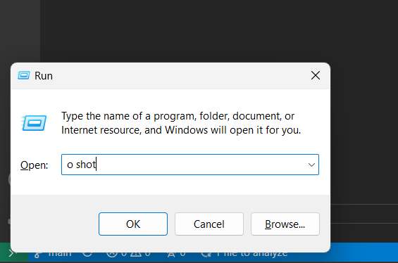

# What is WindowsRunTool
I have been using run panel as an easy interface to run different simple or complex tasks for many years.
It became so handy that I thought that can be defined as separate tool, and anyone can enjoy this.

This windows OS project maximizes run panel functionality to do 3 different things:
1. Operation (run script)
2. Open URL (from browser history)
3. Fetch information (from user defined text file)

These are defined by key commands o, u, and i

Like example below is running shot operation:

# Installation
`pip install -r requirements.txt` 

`python installer.py`

What it does:
1. This add current directory to path env variable (if not added earlier)
2. Create key bat files and their link files (if not created earlier)
3. Create directory for each key (if not created earlier)

So, you can manually do the job, if installer fails to complete the task.

# Documents
1. [operations [o ...]](docs/OPERATIONS.md)
2. [existing scripts](docs/EXISTING_SCRIPTS.md)
3. [info [i ...]](docs/INFORMATION.md)
4. [urls [l ...]](docs/URLS.md)
5. [user configuration](docs/USER_CONFIGURATION.md)
6. [add key commands or scripts](docs/HOW_TO_ADD)
2. [debug](docs/DEBUG.md) 

