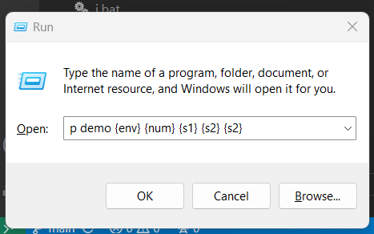
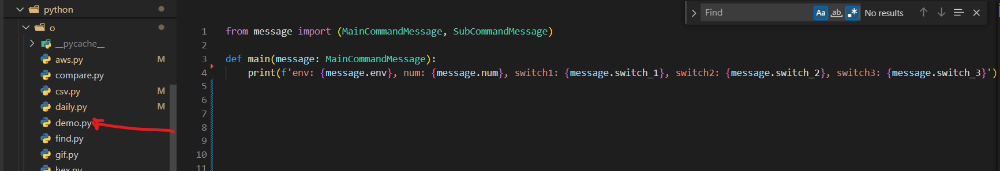
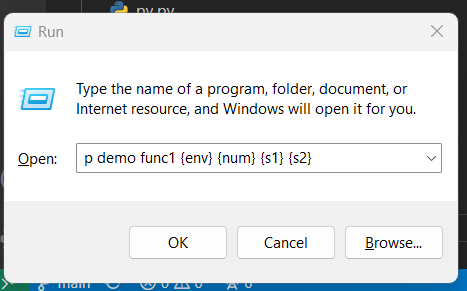
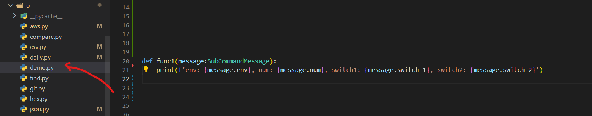

## What is WindowsRunTool
I have been using run panel as an easy interface to run different simple or complex tasks for many years.
It became so handy that I thought that can be defined as separate tool, and anyone can enjoy this.

This windows OS project maximizes run panel functionality to do 3 different things:
1. Operation (run script)
2. Open URL
3. Fetch information

These are defined by key commands o, u, and i

Like example below is running shot operation:

## Operation: [key: o]

Follow super simple installation steps to setup the project.
Check /python/p directory which has couple of scripts, a good example is demo.py file.
It has main(), func1() and func2()
Those functions are triggered using run panel like:

p demo => demo.main()

is going to run

or other cases be like calling other functions in the file (which are not main)

p demo func1 => demo.func1()

is going to run

this way you can call many python scripts and functions

you can also pass some parameters to these functions like 
a number, 2 or 3 strings (3 strings to main() and 2 strings to func1 or func2), predefined values like:
an env fix value from [dev, staging, prod], help and debug

Play around and run demo functions with parameters to see how they are passed to functions as properties of MainCommandMessage and SubCommandMessage.

Check structure of these object in python/message.py
There are some other scripts that I found useful example to increase productivity.
Open run panel (WinKey+r) and type 'p -help' to check all existing script
Check each functionality by specifying the key command like 'p -help demo' or 'p -help record'

You can create your own python file, and just call it from run panel.

## Existing scripts

## Installation
pip install -r requirements.txt 

python installer.py
What it does:
1. This add current directory to path env variable (if not added earlier)
2. Create key bat files and their link files (if not created earlier)
3. Create directory for each key (if not created earlier)

So, you can manually do the job, if installer fails to complete the task.

## Add extra key commands
Modify Installer if you want additional key command, by default it only provide ['o', 'i', 'l']
python installer.py

## Add your script
demo.py file is an example script. Add new script file and with couple of functions in p directory.

Call it from run panel and pass some parameters.

## Notepad folding style
I use diff language to store information, as it appears to be easy to use the folding structure
Style and keywords can be checked here from notepad++ source code
https://github.com/notepad-plus-plus/notepad-plus-plus/blob/master/lexilla/lexers/LexDiff.cxx
There is no external language model file to define diff language syntax for notepad++
In short these keywords are used to form folding structure:
1. first level folding: 'diff ', 'Index: '
2. second level folding: '? ', '--- '
3. third level folding: '@ '

# Documents
1. [operations [o ...]](docs/OPERATIONS.md)
1. [info [i ...]](docs/INFORMATION.md)
1. [urls [l ...]](docs/URLS.md)
2. [debug](docs/DEBUG.md) 

