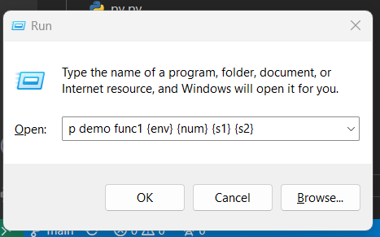

# Operation: [key: o]

Follow super simple installation steps to setup the project.
Check `/python/p` directory which has couple of scripts, a good example is `demo.py` file.
It has `main()`, `func1()` and `func2()`
Those functions are triggered using run panel like:

`p demo` => demo.main()

is going to run

or other cases be like calling other functions in the file (which are not main)

`p demo func1` => demo.func1()

is going to run

This way you can call many python scripts and functions.

You can also pass some parameters to these functions like 
A number, 2 or 3 strings (3 strings to main() and 2 strings to func1 or func2), predefined values like:
An env fix value from [dev, staging, prod], help and debug

Play around and run demo functions with parameters to see how they are passed to functions as properties of MainCommandMessage and SubCommandMessage.

Check structure of these object in `python/message.py`
There are some other scripts that I found useful example to increase productivity.
Open run panel `WinKey+r` and type `p -help` to check all [existing scripts](EXISTING_SCRIPTS.md).
Check each functionality by specifying the key command like `p -help demo` or `p -help record`

You can create your own python file, and just call it from run panel.