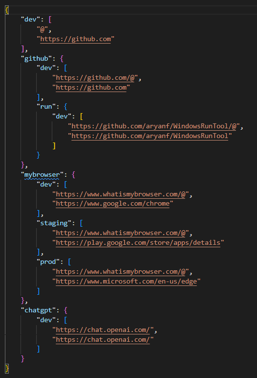

# URL Commands

Url commands can be used to query browser history and open a page that match the criteria.


Assumption is that env items are `[dev, staging, prod]`. If you use different envs, then this should be modified in `user_configuration.json` and `url.json`

You can associate an env to specific browser in `user_configuration.json`

There is urls.json file that define how it should work, see example below




Each env needs to have two items
```
"dev": [
            "https://github.com/@",
            "https://github.com"
        ]
```
First item specifies the base url, and @ indicate where in the url the search input should be inserted.
Second item specifies what url should be used as default if no record is found by provided criteria in browser history database.

Use `WinKey + r` to open run panel, and then type

- `u chatgpt` => to open https://chat.openai.com/
- `u mybrowser dev cat` => to open most recent link from chrome history that start with https://www.whatismybrowser.com and has cat inside. In this case dev needs to be mapped to chrome in user config file. If nothing is found then it opens https://www.google.come/chrome
- `u mybrowser prod dog` => to open most recent link from edge history that start with https://www.whatismybrowser.com and has dog inside. In this case prod needs to be mapped to edge in user config file. If nothing is found then it opens https://www.microsoft.com/en-us/edge
- `u mybrowser prod dog mouse` => to open most recent link from edge history that start with https://www.whatismybrowser.com and has dog and mouse inside. The default logic operator is AND, which can be overwritten by specifying OR.
- `u mybrowser or prod dog cat mouse` => to open most recent link from edge history that start with https://www.whatismybrowser.com and has dog OR cat OR mouse inside.
- `u mybrowser dog cat or mouse` => to open most recent link from chrome history that start with https://www.whatismybrowser.com and has dog OR cat OR mouse inside. The order of search input and operator does not matter.
- `u mybrowser dog cat or mouse 3` => to open 3rd recent link from chrome history that start with https://www.whatismybrowser.com and has dog OR cat OR mouse inside. The order of search input, operator and number does not matter.


- `u -help` => to open json file and modify it

<br/><br/>
<br/><br/>


